
  

- Author: [Xue Bin Peng](https://xbpeng.github.io/), Glen Berseth, and [Michiel van de Panne](https://www.cs.ubc.ca/~van/)
- Proceeding: ACM Transactions on Graphics (TOG) (Proc. ACM SIGGRAPH 2015)
- Paper: [PDF](https://dl.acm.org/doi/pdf/10.1145/2766910)
- Videos: [Part 1](https://www.youtube.com/watch?v=mazfn4dHPRM), [Part 2](https://www.youtube.com/watch?v=RTuSHI5FNzg)

## Abstract

Physics-based characters에 대한 locomotion skills은 대부분 flat terrain에서 이루어진다. 하지만 locomotion skills은 더 복잡한 지형에서 dynamic하고 momentum-based motions의 생성이 잘 이루어져야한다.

이 논문에서는 simulated characters가 gaps, steps, walls를 지닌 지형을 매우 dynamic한 걸음걸이를 이용하여 이동할 수 있는 controllers를 학습한다. 이러한 controllers를 학습시킬 수 있도록 4가지 방법을 가진 강화학습을 사용한다.

- **Action representation**
- **Non-parametric approximation** of both the value function and the policy
- **Epsilon-greedy exploration**
- The learning of a good **state distance metric**

이러한 방법을 통해 21-link planar dog와 7-link planar biped가 bounding과 running의 걸음걸이를 이용하여 지형의 challenging sequences들을 navigate한다.

---

## 1. Introduction

Physics-based simulation은 hand-crafted abstractions와 feedback laws에 기초한 control 방법, 적절한 feedback laws를 최적화하기 위한 policy search, model-predictive control (MPC) control 방법 등 고전적인 다양한 control 방법을 통해 달성되었다.

이 논문에서의 저자는 gaps, walls 및 steps를 포함하는 다양한 지형에서 매우 dynamic한 motions에 대한 control 전략을 학습함으로써 simulated된 연결된 figures의 기능들을 확장한다. 고전적인 방법이 아닌 몇 가지 특징을 지닌 **reinforcement learning (RL)**을 이용한다.

- Continuous and high-dimensional states and actions
- Value-iteration based on a set of $(s, a, r, s')$ transition tuples, using positive temporal difference (PTD) updates, followed by tuple-culling
- Non-parametric kernel-based value function and policy approximation, with outlier removal
- An embodied state representation and an optimization process for learning a good state distance metric
- A progressive learning approach that alternates between $\epsilon$-greedy exploration and value iteration.

---

## 2. Related Work

### 2.1 Physics-based character animation

Control에 대한 한가지 접근방식은 constraints와 objectives가 혼합된 motion을 위한 short term goals를 정하는 것이다. 그리고 나면 inverse dynamics를 통해 control에 대한 motion이 계산될 수 있다. 이러한 방법들이 equations of motion (EOM)의 명시적인 model을 활용하기 때문에 종종 model-predictive control (MPC) 방법으로 분류된다. 또 다른 접근방식의 카테고리는 EOM에 대한 full knowledge를 가정하지 않고, 높고 또는 낮은 수준의 goals을 통해 이러한 목표들을 달성하는 데 도움이 되는 actions를 계산하는 명시적인 control policies를 개발하는 것이다.

### 2.2 Reinforcement Learning

좋은 control 전략들을 학습하는 것은 그러한 control 전략들을 design하는 데에 있어 또 다른 대안이다. Animation에서, RL은 motion이 motion clips로 구성되는 kinematic적인 motion의 models에 매우 성공적으로 적용되었다. 하지만 성공하기에 앞서 RL 방법들은 control이 많은 부분들이 간접적인 형태였기 때문에 physics-based character animation에 적용하기에 매우 힘든 도전이었다. Motion clips들은 discrete states, discrete actions으로 작용하는 반면, physics-based character는 continuous하고 high-dimensional state space와 action space를 가진다. 따라서 많은 연구자들이 이러한 부분에서 아래의 키워드를 중심으로 강화학습을 이용하여 연구하고 있다.

- Continuous actions spaces
- Policy search methods, non-linear function approximators
- value-iteration or policy-iteration methods
- Methods based on non-parametric kernel estimation and Gaussian processes
- Experience replay or batch-based RL methods

---

## 3. Overview

저자의 목표는 physics-based character가 다양한 지형이 주어질 때 dynamic한 걸음걸이를 통해 이동하는 control policies를 생성하는 것이다.

 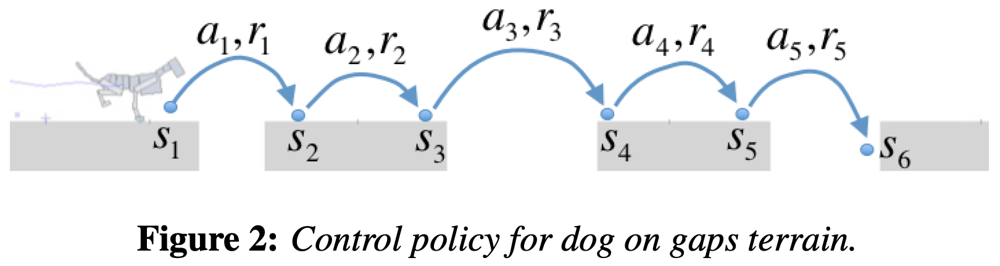 

위의 그림에서 gaps는 random intervals에 위치되는 random width의 gap으로 구성된다. 각각의 action $a_i$는 성공 또는 실패일지도 모르는 착지 (bound)와 뛰기 (leap)를 생성한다. State $s_i$는 particular pose와 velocities 뿐만 아니라 뒤따르는 지형의 state를 포함하고, reward $r(s,a)$는 action의 결과이며 forward motion에는 reward를 주고 falls와 fall에 대한 movement effort에는 penalty를 준다.

 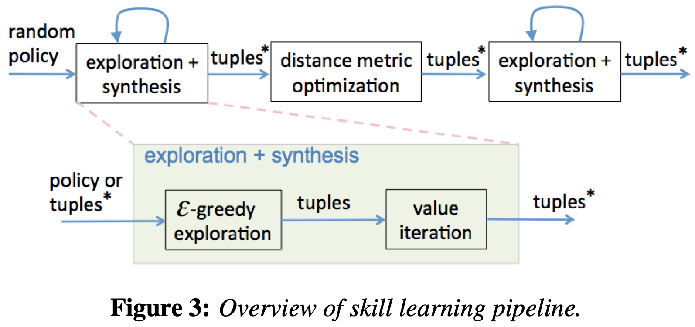 

### 3.1 Transition tuples

위의 그림처럼 multi-step learning pipeline은 정책 결정에 따른 future-dscounted rewards의 sum인 $V(s)$를 최대화하는 것으로 정의되는 최적의 control 정책을 학습한다. 학습은 **transition tuples** $T = \{(s_i, a_i, r_i, s_i')\}$의 지속적인 축적을 통해 이루어지고, transition tuples은 exploration 단계 동안 지형을 이동하는 character의 모든 과거의 experiences를 포함한다.

Exploration으로부터 만들어진 tuples은 그림 하단 부분과 같이 최적의 정책을 계산하기 위해 value iteration 단계에서 사용된다. 각각의 tuple $T_i$를 이용하여 valud function $V_i$와 optimal policy tuple 속성 (attribute) $\Pi_i = true \mid false$로 나타낼 수 있다. 여기서 Optimal policy tuple set $T^*$는 속성 $\Pi_i$가 활성화된 모든 tuples의 set에 의해 정의된다.

$$T^* = \{ T_i|\Pi_i = true \}$$

### 3.2 A small set of fixed actions

Hand로 design되거나 또는 별도의 optimization process를 하는 동안 design되는 **고정된 action의 samll set**은 policy synthesis process (random policy부터 distance metric optimization까지)를 초기화하기 위해 사용된다. 고정된 actions 사이의 uniform random choices를 만드는 a policy는 transition tuples의 initial set $T_i$를 모으기 위해 사용된다. 또한 이러한 transition tuples는 an initial policy tuple set $\Pi_i$를 만드는 데에 사용된다.

### 3.3 Distance metric optimization

이 논문의 학습 pipeline의 중요 step은 distance metric optimization이다. 구체적으로, $\hat{V} (s)$와 $\hat{\pi} (s)$를 estimate하는 Non-parametric (i.e., sample-based) function approximator는 $k$NN interpolation으로 되어져 있다. 이 방법은 a query state $s$와 가장 관련성이 높은 근처 states $\{ s_i \}$를 찾기 위해 좋은 distance metric 가지려고 한다. distance metric optimization 방법은 가장 기본적인 hand-designed distance metric을 대체하기 위해 사용된다.

---

## 4. Policy Synthesis

- $\pi: S \rightarrow A$, a control policy
- $S \in \mathbb{R}^n$: continuous state of the character and the upcoming terrain
- $A \in \mathbb{R}^m$: continuous action of bound or leap

### 4.1 Non-parametric function approximation

Continuous한 states와 actions를 이용하여 value function $V(s)$와 control policy (deterministic policy) $a=\pi(s)$를 나타내기 위해 function approximators가 필요하다. 따라서 저자는 value function과 policy에 대해 tuples $T$에 기반한 non-parametric approximation method를 사용한다. 각각의 tuple $T_i$은 아래의 그림 (b)와 같이 transition tuple $s_i$의 시작 상태와 관련된 value function $V_i$과 action $a_i$를 저장한다.

 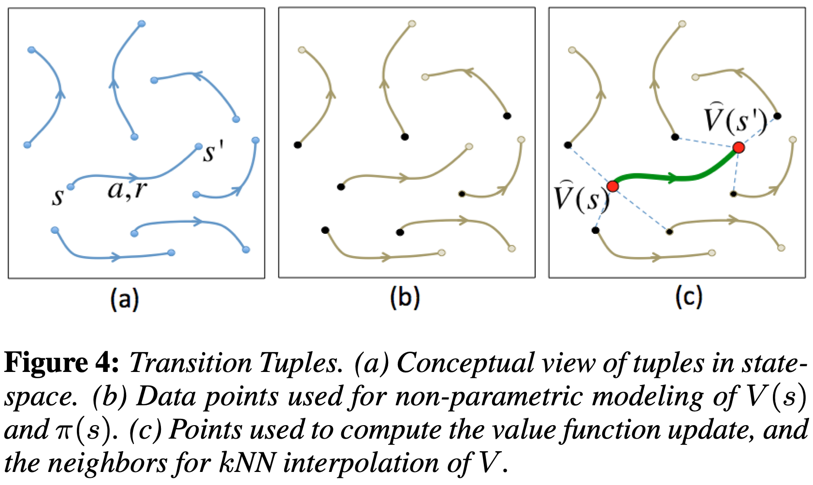 

Function approximation에 대해 저자는 Gaussian kernel (weighted Gaussian kernel)를 이용한 $k$NN interpolation을 이용한다.

$$\hat{V}(s)=\frac{1}{W} \sum_{i=1,...,k} w_i V_{N_{i} (s)} \delta_i$$

- $W = \sum_{i=1,...,k} w_i \delta_i$
- $N_i (s)$: tuple index of the $i$th nearest neighbor of state $s$
- $w_i = k(d) = e^{\frac{-d^2}{\sigma_\lambda^2}}$
- $\sigma_\lambda$: kernel width
- $d$: kernel distance

$$d(s,s_j)=(s-s_j)^T M(s-s_j)$$

- $M = diag(\mu)$
- $\mu$: vector defining a set of to-be-learned normalized weightings
- $\delta_i$: trimming function that can be used for outlier removal

Gaussian kernel (weighted Gaussian kernel)를 이용한 $k$NN interpolation에 대한 더 자세한 내용은 [KNN Interpolation with a Gaussian Kernel](https://dongminlee94.github.io/paper/2020/06/22/knn_interpolation_with_a_gaussian_kernel/)을 참고하길 바란다.

Value function approximation에 대해서 저자는 $\delta_i = 1$로 두었다. 다시 말해 outlier removal를 적용하지 않았다. 하지만 policy function approximation에 대해서 outlier removal는 performance에서 중요하다.

구현에서는 $k=10$으로 사용하였고, high-dimensional space에서 많은 수의 tuples로 빠른 queries를 하도록 만들기 위해 4 randomized k-d trees를 이용한 FLANN library를 이용했다.

### 4.2 Outlier removal

 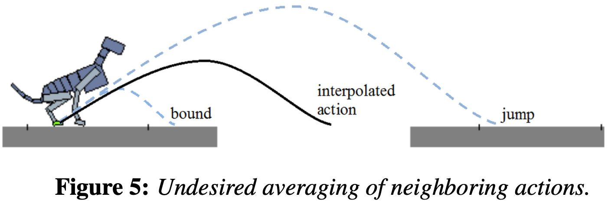 

 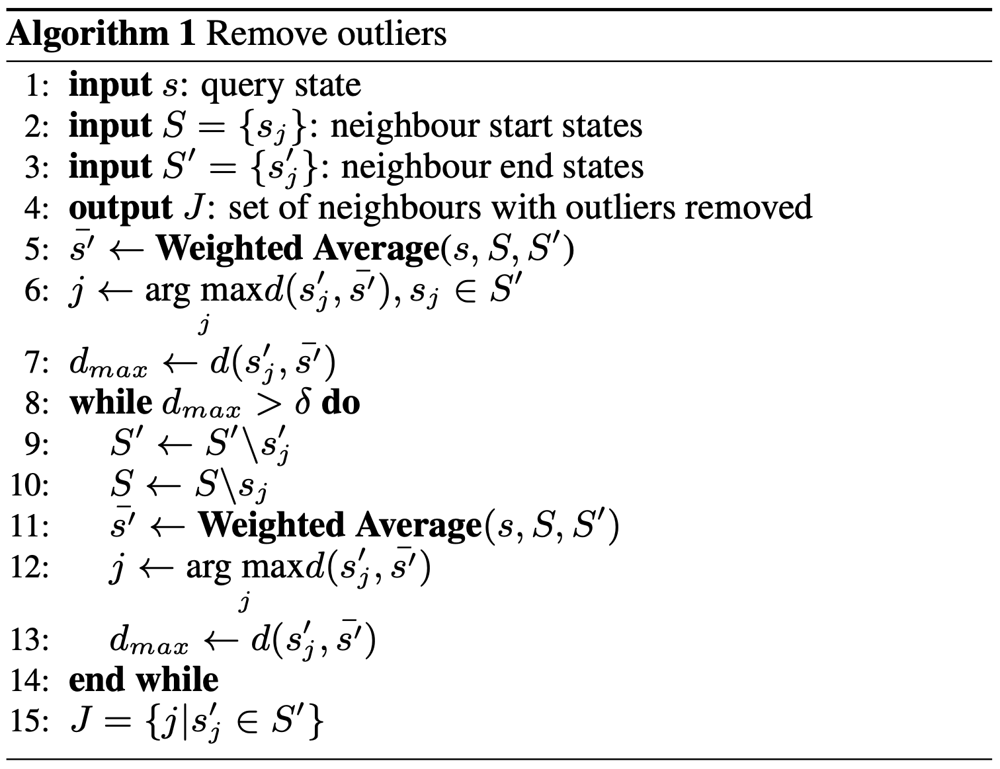 

### 4.3 Value iteration

 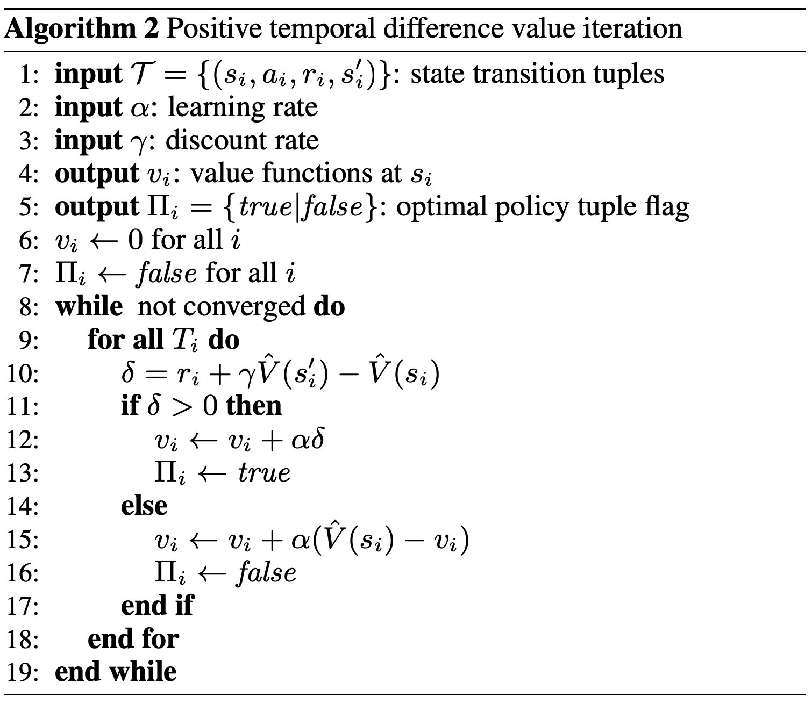 

### 4.4 Exploration

 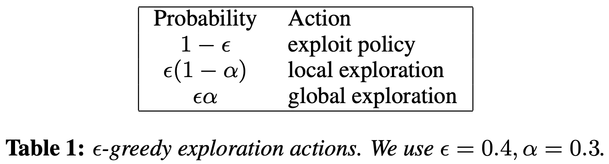 

---

## 5. Action Parameterization

### 5.1 Dog actions

 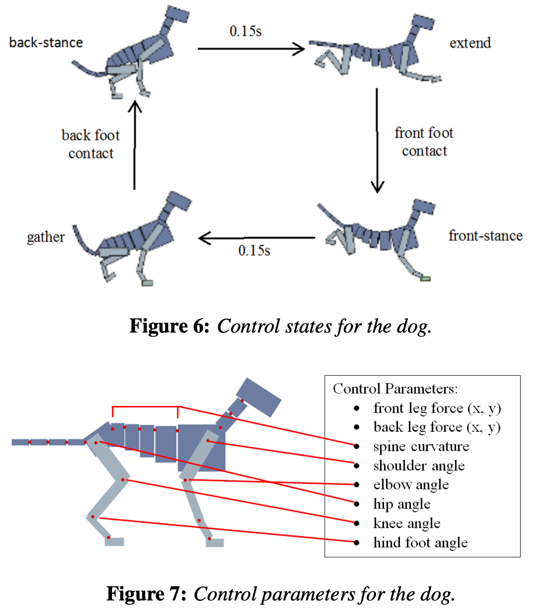 

 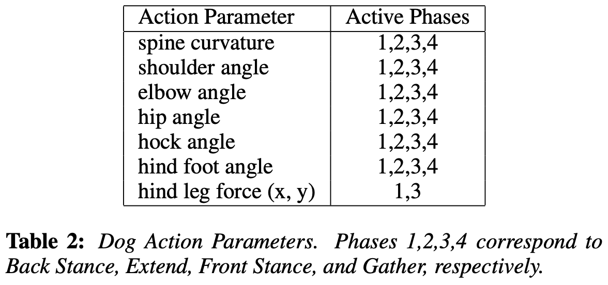 

### 5.2 Biped actions

 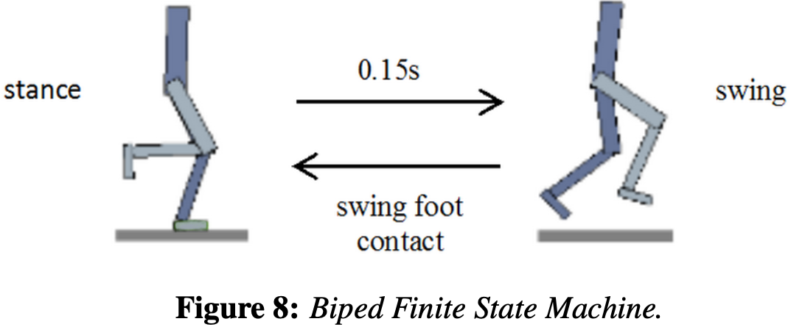 

 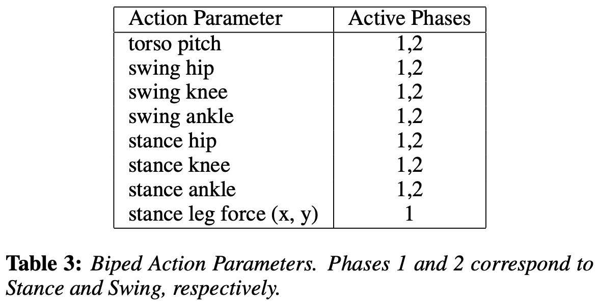 

### 5.3 Initial actions

TBU
