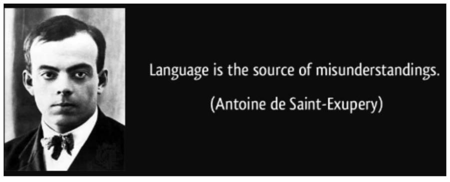
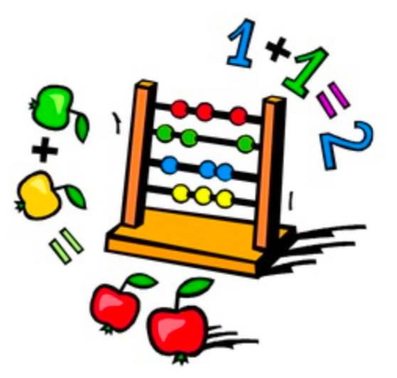

오래전부터 개인적으로 너무 좋아하고 존경하는 분이 생겼다. 이 분의 강의를 들으면서 많은 것들을 알게되었고, 처음으로 '나도 열심히해서 나중에 이 분처럼 되고 싶다..!'라는 생각이 들었다. 나에게는 너무 뜻깊고 감사한 분이다.

강의를 들으면서 항상 해주신 말씀이 있는데 너무 좋은 말씀이라 재생-정지-되감기를 반복하면서 공책에 적게 되었다. 예전에 Inverse RL에 처음 접하게 되면서도 정리를 했었는데 몇달전부터 GP를 공부하다가 함수 해석학적인 강의를 듣게 되어서 다시한번 정리해볼 필요가 있다고 느꼈다.

RL의 논문들을 보다보면(굳이 RL 논문이 아니더라도) 다양한 notation들과 equation들이 나온다. 많은 용어들, 이에 따른 정의와 정리에 대해서 나오는데 기존에 강화학습의 용어와 정의, 정리를 알고 있다고 하더라도 약간의 차이가 있을 수 있다.

그러니까 하고 싶은 말이 무엇이냐면, 어떠한 다른 세부분야의 논문들도 기존에 쓰이는 용어와 정의, 정리에서 약간 변형하거나 아예 색다른 모습을 띈 notation들과 equation들로 나올 수 있다는 것이다. 그래서 처음에 용어와 정의, 정리들을 파악할 때 제대로 파악해놓지 않으면 나중에 가서 헷갈리는 경우가 많다.

  

위에 그림에서 Saint-Exupery가 했던 말처럼 "Language is the source of misunderstandings". 따라서 새로운 것들이 하나씩 하나씩 튀어나올 때마다 정말 집중해서 봐야할 필요가 있다.

  

여기서 "**정의(Definition)**"란 따로 증명하지 않아도 되는 하나의 약속이다. 예를 들어 "1+1=2, 2+2=4"겠지만, "강아지+고양이=악어, 고양이+사람=강아지"라고 약속을 하고, 이 약속을 지키는 어떠한 공간을 만들어낸다면, 간단하게 우리가 쉽게 생각할 수 있는 대소관계가 들어가는 $+,-,\times,\div$ 대수 공간인 *vector space*를 만들어낼 수 있다. 이후에 distance를 주면 *metric space*, size를 주면 *normed space*, similiarity를 주면 *inner-product space*, 더 들어가서 inner-product space 중에서의 complete space인 *hilbert space*까지. 이렇게 약속을 하고 공간을 주면 우리도 하나의 약속이 있는 공간을 만들 수 있는 것이다. 그렇기 때문에 <U>정의가 나오면 그대로 받아들어야 한다.</U> 왜냐하면 정의이기 때문이다. "왜?"라는 물음보다는 "아 그렇구나! 그렇다는데 뭐..! 받아들이자-!!"라고 생각하면 편해지는 것 같다.

다음으로 "**정리(Theorem)**"란 하나의 약속이 아니라 가정으로부터 증명된 명제이다. 따라서 <U>정리를 말할 때는 반드시 증명이 되어야하고 실제로 증명을 해봐야 안다</U>. 개인적으로 정리의 증명을 따라가다보면 '나중에 이렇게 편하게 쓰려고 만들었구나!' 정도에 생각이 들면서 정리를 만든 사람의 의도를 알 수 있는 것 같다. 예전에 좋아하고 존경하는 또 다른 분의 글을 보고, 증명하는 것이 때론 너무 힘들어서 '대충하고 넘어가자' 란 생각이 들때도 있지만 대충하다가 나중에 재앙이 일어나 버린다고 말씀해주셔서 다시 마음을 다잡았다.

[https://www.facebook.com/sungbin87/posts/2424263917598275](https://www.facebook.com/sungbin87/posts/2424263917598275)

끝으로 정리해보면 다음과 같다.

- 정의(Definition) : 증명 x, 약속 o, 토달지 말고 받아들이기
- 정리(Theorem) : 증명 o, 약속 x, 왜 이러한 정리가 나왔는지 증명을 통해서 꼼꼼히 수식에 민감하게 굴면서 눈 부릅뜨고 파악하기
- 공리(Axiom) : 증명 x, 누가봐도 자명한 명백한 사실

아직 쌩판 뭣도 모르는 연구 초보자라 이것저것 잘 모르겠지만, 내가 이렇게까지 생각해볼 수 있도록 알려주신 그 분께 정말 감사드린다.
