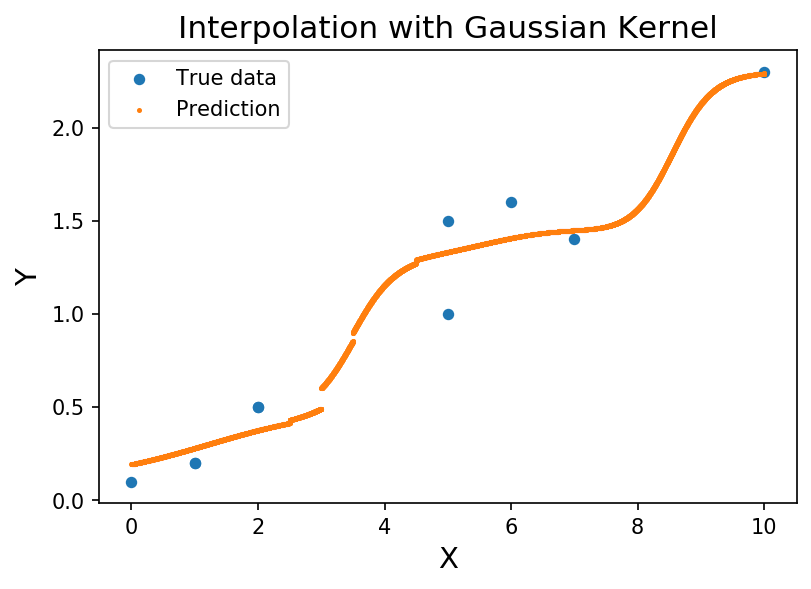

  

예전 논문들을 읽다가 kernel method를 이용한 방법들이 자주 나와서 정리하려고 한다. 아주 단순한 개념들부터 마지막에는 **KNN Interpolation with a Gaussian Kernel**까지 정리해보자.

## 1. Kernel

"Kernel"이라는 단어는 생각보다 많은 분야에서 사용하고 있다. 대표적인 분야들을 나열해보자 ([Wikipedia](https://en.wikipedia.org/wiki/Kernel) 참고).

- [Kernel (operating system)](https://en.wikipedia.org/wiki/Kernel_(operating_system)), the central component of most operating systems
- [Kernel method](https://en.wikipedia.org/wiki/Kernel_method), in machine learning
- [Kernel (linear algebra)](https://en.wikipedia.org/wiki/Kernel_(linear_algebra)), inverse image of zero under a homomorphism
- [Kernel (statistics)](https://en.wikipedia.org/wiki/Kernel_(statistics)), a weighting function used in kernel density estimation to estimate the probability density function of a random variable

이외에도 더 많은 분야들이 있지만, 대표적으로 4개 분야에서 kernel이라는 단어가 사용되는 것 같다.

[Wikipedia](https://en.wikipedia.org/wiki/Kernel)에도 나와있듯이 매우 많은 분야에서 kernel이라는 단어를 사용 중이기 때문에 각각의 분야에서의 kernel의 정의도 다 다를 것이다. 하지만 한 가지 공통되는 점은 대부분의 "kernel"이라는 단어를 "core, generalization, mixture"의 개념으로 사용 중인 것 같다. 세부적인 어떤 것이 아니라 세부적인 것들을 하나로 묶는 어떠한 core, generalization, mixture로 생각하면 어떤 분야든지간에 kernel의 내용을 보기가 편할 것이다.

다음으로 머신러닝에서 주로 쓰이는 kernel method에 대해서 알아보자.

---

## 2. Kernel Method

머신러닝에서의 kernel method는 패턴 분석을 위한 알고리즘들의 하나의 범주, 유형으로서, 알고리즘들 중 많이 쓰이는 알고리즘은 SVM (Support Vector Machine)이다. kernel method은 [kernel function](https://en.wikipedia.org/wiki/Positive-definite_kernel)을 사용하여 <U>input space</U> 내 데이터의 좌표를 계산하지 않고 오히려 <U>feature space</U> 내에 모든 데이터 사이의 inner product를 계산함으로써 high-dimensional, *implicit* feature space에서 할 수 있게 한다. 이러한 연산은 종종 좌표의 *explicit* 계산보다 덜 계산적이다. 이러한 접근법을 "**kernel trick**"이라고 한다.

그렇다면 kernel function은 무엇일까? kernel function에 대해서 알아보자.

---

## 3. Kernel Function (Positive-definite Kernel)

Kernel function은 다른 말로 positive-definite kernel이라고도 하는데, positive-definite function or positive-definite matrix의 generalization이다.

### Definition

Let $\mathcal{X}$ be a nonempty set, sometimes referred to as the index set. A symmetric function $K: \mathcal{X} \times \mathcal{X} \to \mathbb{R}$ is called a positive-definite (p.d.) kernel on $\mathcal{X}$ if

$$\sum_{i=1}^n \sum_{j=1}^n c_i c_j K(x_i, x_j) \ge 0$$

holds for any $x_1, \cdots, x_n \in \mathcal{X}$, given $n \in \mathbb{N}, c_1, \cdots, c_n \in \mathbb{R}$

### Examples of positive-definite kernels

- Common examples of positive-definite kernels defined on Euclidean space $\mathbb{R}^d$ include:
  - Linear kernel: $K(\mathbf{x}, \mathbf{y}) = \mathbf{x}^T \mathbf{y}, \quad \mathbf{x},\mathbf{y} \in \mathbb{R}^d$
  - Polynomial kernel: $K(\mathbf{x}, \mathbf{y}) = (\mathbf{x}^T\mathbf{y}+r)^n, \quad \mathbf{x},\mathbf{y} \in \mathbb{R}^d, r \ge 0, n \ge 1$
  - [Gaussian kernel (Radial basis function kernel (RBF Kernel))](https://en.wikipedia.org/wiki/Radial_basis_function_kernel): $K(\mathbf{x}, \mathbf{y}) = e^{-\frac{\|\mathbf{x} - \mathbf{y}\|^2}{2\sigma^2}}, \quad \mathbf{x}, \mathbf{y}\in\mathbb{R}^d, \sigma>0$
  - Laplacian kernel: $K(\mathbf{x}, \mathbf{y}) =e^{-\alpha\|\mathbf{x} - \mathbf{y}\|}, \quad \mathbf{x}, \mathbf{y}\in\mathbb{R}^d, \alpha>0$
- If $H$ is a Hilbert space, then its corresponding inner product $(\cdot,\cdot)_H : H \times H \to \mathbb{R}$ is a p.d. kernel. Indeed, we have

$$\sum_{i,j=1}^n c_i c_j (x_i, x_j)_H = \left(\sum_{i=1}^n c_i x_i, \sum_{j=1}^n c_j x_j\right)_H= \left\|\sum_{i=1}^n c_ix_i\right\|_H^2\ge 0$$

다음으로 kernel function들 중에서도 Gaussian kernel function에 대해 알아보자.

---

## 4. Gaussian Kernel (RBF Kernel)

Kernel function들 중에서도 가장 대표적이고 인기있는 kernel은 Gaussian kernel이다. Gaussian kernel은 radial basis function kernel 또는 RBF kernel이라고도 불리는데, 각각의 뜻에 대해서 알아보자.

먼저 "radial"은 한국말로 번역해보면 방사상의, 반지름 방향의, 방사상 구조의 등의 뜻이 있다. 여기서의 적당한 뜻은 '반지름 방향의'이다. [Wikipedia](https://en.wikipedia.org/wiki/Radial_function)에 있는 내용을 보면 'depends only on the distance between that point and the origin'이라고 나와있다. 즉, '<U>거리 (위치)에만 의존하는 함수</U>'라는 말이다.

다음으로 "basis"는 한국말로 번역해보면, 기준, 근처, 기초, 토대 등으로 나온다. 여기서는 선형대수에서 많이 쓰던 '기저'로 보면 된다. <U>어떠한 벡터 공간을 선형 생성 (linear span)하는 선형 독립 (linear independent)인 벡터들의 집합을 말할 때 사용되는 기본적인 인자</U>이다.

그렇다면 "radial basis function"은 무엇일까? 바로 어떠한 함수를 표현할 때 사용하는 basis로 radial function을 사용한다는 것이다. 다시 말해, **어떤 함수에 대한 근사 (approximation) 모델을 radial function의 선형 조합으로 표현할 수 있다는 것이다.**

여기서 kernel까지 추가한 "radial basis function kernel (RBF kernel)"에 대해서 알아보자. 머신러닝에서 많이 쓰이는 RBF kernel은 다양한 kernelized learning algorithm들에서 사용되는 인기있는 kernel function이다. 대표적으로는 SVM classification에서 많이 쓰인다.

### Definition

The [RBF kernel](https://en.wikipedia.org/wiki/Radial_basis_function_kernel) on two samples $x$ and $x'$, represented as feature vectors in some input space, is defined as

$$K(\mathbf{x}, \mathbf{x'}) = \exp\left(-\frac{\|\mathbf{x} - \mathbf{x'}\|^2}{2\sigma^2}\right)$$

$\|\mathbf{x} - \mathbf{x'}\|^2$ may be recognized as the squared Euclidean distance between the two feature vectors. $\sigma$ is a free parameter.

### Weighted RBF Kernel (WRBF Kernel, Weighted Gaussian Kernel)

A more general RBF kernel can be derived as a [weighted RBF (WRBF) kernel](https://ieeexplore.ieee.org/document/6351707) which makes use of a weghting matrix $\mathbf{A}$ to account for least squares error between two sample vectors by

$$K(\mathbf{x}, \mathbf{x'}) = \exp \left(-\frac{(\mathbf{x} - \mathbf{x'})^T \mathbf{A} (\mathbf{x} - \mathbf{x'})}{2\sigma^2}\right)$$

where $\mathbf{A}$ is a positive definite matrix.

---

## 5. KNN Interpolation (Smoothing)

KNN Interpolation은 다차원 공간에서 multivariate interplation을 하는 하나의 방법이다. 여기서 interpolation은 보간, 개입이라고도 번역이 되는데, **어떠한 공간에서 주어지지 않는 (non-given) 점에 대한 함숫값을 근사하는 문제**로서, <U>그 주변 (neighboring) 지점의 함숫값이 주어졌을 때, 주변 점들에 대한 해당 점의 함숫값을 근사하는 문제</U>이다. 더 쉽게 말하자면, $x$라는 변수의 함수 $f(x)$의 형태는 알 수 없으나 몇 가지 $x_i$에 대한 함숫값 $f(x_i)$가 알려져 있을 때 그 사이의 임의의 x에 대한 함숫값을 추정, 근사하는 문제라고 말할 수 있다.

### Interpolation vs. Regression

그렇다면 interpolation과 regression은 무엇이 다를까? interpolation과 regression의 주요 차이점은 해결하고자하는 문제의 정의이다.

Interpolation은 <U>data point가 n개 주어진 경우, 각각의 data point에 정확히 지정된 값을 갖는 미리 정의된 함수를 찾고자 한다</U>. 즉, $(x_i,y_i)$가 주어졌을 때, $f(x_i) = y_i$를 만족시키는 어떤 사전 정의된 형태의 $f$라는 함수를 찾고 싶다는 것이다. 가장 일반적으로 $f$는 다항식으로 주어진다.

Regression은 보통 cost나 sum of squares of errors를 최소화하는 함수를 찾고자 한다. <U>주어진 data point에서의 함숫값이 정확한 값을 가질 필요가 없으며, 단지 좋은 근사치를 가지고 싶을 뿐이다</U>. 일반적으로 함수 $f$는 어떠한 data point에 대해서도 $f(x_i)=y_i$를 만족시키지 못할 수 있지만, cost function, 즉 $\sum_{i=1}^n (f(x_i) - y_i)^2$는 주어진 형태의 모든 함수 중에서 가장 작은 것이 될 것이다.

그렇다면 왜 interpolate (보간치?) 대신 approximate (근사치)가 필요할까? 여기에 대한 좋은 예가 주식시장 가격이다. 최근 몇 시간동안의 주식 가격을 가지고 다음 몇 시간을 예측하기 위해 그 주식 가격으로 interpolate를 구할지도 모른다. 하지만 가격 간의 관계가 다항식으로 정확히 표현하기 어렵기 때문에 이러한 생각은 오히려 좋지 않은 생각이다. 여기서 linear regression은 한 가지 좋은 trick일 수 있다. linear regression은 가격에 다소 "경사 (slope)"를 가질 수 있고 선형 함수가 적어도 locally하게 좋은 근사치가 될 수 있기 때문이다.

---

## 6. KNN Interpolation with a Gassian Kernel

Gassian kernel을 사용한 KNN interploation에 대해서는 참고한 링크를 적고 마치도록 하겠다.

- [Make Your KNN Smooth with Gaussian Kernel](https://towardsdatascience.com/make-your-knn-smooth-with-gaussian-kernel-7673fceb26b9)
- [sklearn.neighbors.KNeighborsRegressor](https://scikit-learn.org/stable/modules/generated/sklearn.neighbors.KNeighborsRegressor.html)

---

## References

- [Kernel](https://en.wikipedia.org/wiki/Kernel)
- [Kernel Method](https://en.wikipedia.org/wiki/Kernel_method)
- [Kernel Function](https://en.wikipedia.org/wiki/Positive-definite_kernel)
- [Gaussian Kernel](https://en.wikipedia.org/wiki/Radial_basis_function_kernel)
- [Weighted Gaussian Kernel](https://ieeexplore.ieee.org/document/6351707)
- [KNN Interpolation](https://en.wikipedia.org/wiki/Nearest-neighbor_interpolation)
- [Interpolation and Regression](https://stats.stackexchange.com/questions/33659/how-is-interpolation-related-to-the-concept-of-regression)
- [KNN Interpolation with a Gaussian Kernel](https://towardsdatascience.com/make-your-knn-smooth-with-gaussian-kernel-7673fceb26b9)
