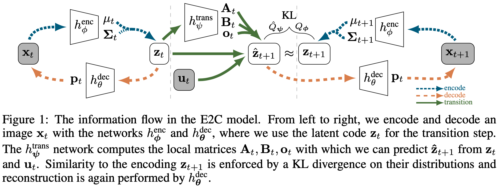
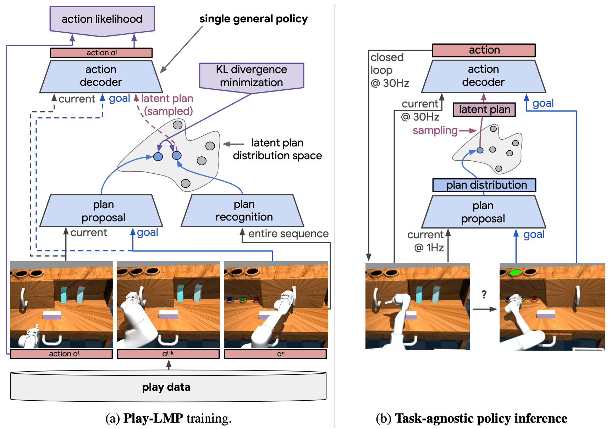
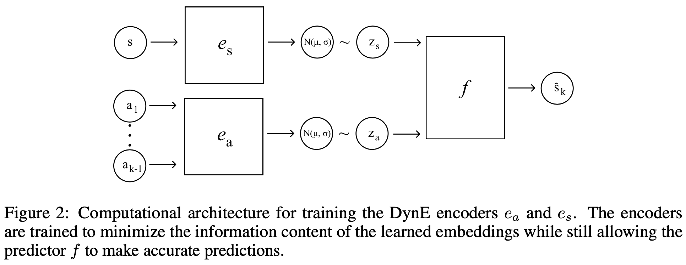
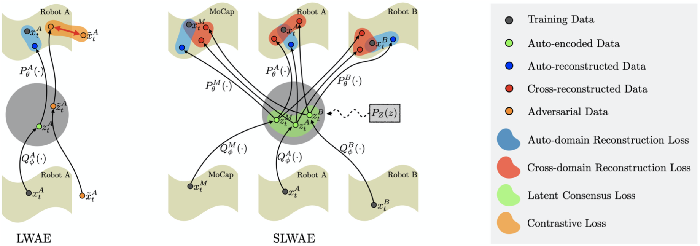
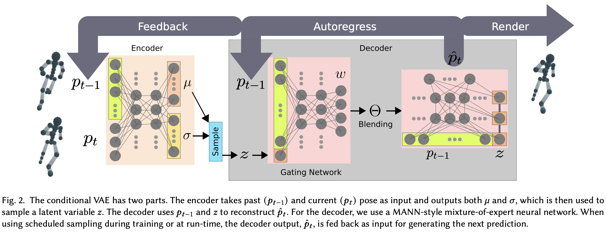

## Outline
  
  1. [Embed to Control: Locally Linear Latent Dynamics Model for Control from Raw Images (2015.11)](#1)
  2. [Learning Latent Plans from Play (2019.03)](#2)
  3. [Robot Motion Planning in Learned Latent Spaces (2019.07)](#3)
  4. [Dynamics-Aware Embeddings (2019.08)](#4)
  5. [Cross-Domain Motion Transfer via Safety-Aware Shared Latent Space Modeling (2020.04)](#5)
  6. [Character Controllers using Motion VAEs (2020.07)](#6)
  7. [Nonparametric Motion Retargeting for Humanoid Robots on Shared Latent Space (2020.07)](#7)
  8. [Goal-Aware Prediction: Learning to Model What Matters (2020.07)](#8)
  9. [Heteroscedastic Uncertainty for Robust Generative Latent Dynamics (2020.10)](#9)

- **Constraint conditions**
  - Papers including VAE
  - Papers including RL
  - Papers excluding Model-Based RL

---

## Embed to Control: Locally Linear Latent Dynamics Model for Control from Raw Images (2015.11)

- Author: Manuel Watter, Jost Springenberg, Joschka Boedecker, Martin Riedmiller
- Proceeding: Conference on Neural Information Processing Systems (NeurIPS) 2015
- Paper: [PDF](http://papers.nips.cc/paper/5964-embed-to-control-a-locally-linear-latent-dynamics-model-for-control-from-raw-images.pdf)

### Abstract

이 논문은 "latent space 안에서 long-term planning을 하면 어떻게 될까?"라는 아이디어에서 나온 논문이다.

Raw pixel image data를 이용하여 global non-linear dynaical systems에 대한 model을 learning하고 control하는 방법인 Emded to Control (E2C)를 제안한다.

E2C는 VAE를 이용하여 dynamics가 locally linear한 경우로 제한된 latent space에서 Raw image data를 이용하여 학습된 embedded image를 통해 trajectory를 생성한다. 이 논문에서의 저자의 의도는 raw image data를 가지고 latent space 안에 mapping되도록 학습시키고, test시에 raw image와 low-dimensional embedded image를 비교했을 때 planning이 더 잘 된다는 것을 보이고 싶은 것이다.

학습된 E2C는 복잡한 control 문제에서 정확한 image sequence의 long-term planning을 예측하였고, 기존의 방법들보다 더 좋은 성능을 보였다.

### Proposed Method

  

---

## Learning Latent Plans from Play (2019.03)

- Author: Corey Lynch, Mohi Khansari, Ted Xiao, Vikash Kumar, Jonathan Tompson, [Sergey Levine](https://people.eecs.berkeley.edu/~svlevine/), Pierre Sermanet
- Proceeding: Conference on Robot Learning (CoRL) 2019
- Paper: [PDF](https://arxiv.org/pdf/1903.01973.pdf)

### Abstract

저자는 로보틱스에서 general-purpose skill에 대한 다양한 레퍼토리로 움직이는 학습된 로봇을 생각했다.

이 논문에서는 사람이 play한 data를 가지고 다양한 skill learning을 하기 위해 self-supervising control 방법을 제안했다.
일반적으로 쓰이는 Learning from Demonstration (LfD)가 아닌 Learning from Play (LfP)으로써 사람이 play한 data는 굉장히 쉽게 구할 수 있고, 많이 구할 수 있다는 장점이 있다.

하지만 data에 의미가 없는 데이터가 많기 때문에 전형적인 LfD 방법으로는 하지 못하고 LfP + self-supervised method를 더하여 Play-LMP (Play-supervised Latent Motor Plans)라는 방법을 고안하였다. 이 방법은 latent space 안에 play한 행동들을 잘 구조화하는 학습을 진행한 후, test time 때 특정한 goal이 주어지면 학습된 latent space 안에서 planning을 하는 기법을 제안하였다.

실험은 robotic tabletop envrionment simulator에서 사람이 지정한 18개의 어려운 visual manipulation task로 하였다.

### Proposed Method

  

---

## Robot Motion Planning in Learned Latent Spaces (2019.07)

- Author: [Brian Ichter](https://research.google/people/BrianAndrewIchter/), Marco Pavone
- Proceeding: IEEE Robotics and Automation Letters (R-AL) 2019
- Paper: [PDF](https://ieeexplore.ieee.org/abstract/document/8653875)

---

## Dynamics-Aware Embeddings (2019.08)

- Author: William Whitney, Rajat Agarwal, [Kyunghyun Cho](https://kyunghyuncho.me/), [Abhinav Gupta](http://www.cs.cmu.edu/~abhinavg/)
- Proceeding: International Conference on Learning Representations (ICLR) 2020
- Paper: [PDF](https://arxiv.org/pdf/1908.09357.pdf)

### Abstract

이 논문에서는 RL에서의 sample efficiency를 향상시키기 위해 self-supervised representation learning을 제안한다.

먼저, states and action sequences에 대한 embedding을 학습한다. 학습된 embedding은 환경의 dynamics에 대한 structure를 학습시켰다고 할 수 있다. 다음으로, plicy를 learning할 때 raw action sequences에서 학습하는 것이 아니라 학습된 action embedding을 이용하여 embedded action sequences를 사용하였다.

결과적으로 model-free RL의 sample efficiency도 높이고 좋은 성능도 보였다.

### Proposed Method

  

---

## Cross-Domain Motion Transfer via Safety-Aware Shared Latent Space Modeling (2020.04)

- Author: [Sungjoon Choi](https://sites.google.com/view/sungjoon-choi/), Joohyung Kim
- Proceeding: IEEE Robotics and Automation Letters (R-AL) 2020
- Paper: [PDF](https://ieeexplore.ieee.org/abstract/document/8972567)

### Abstract

이 논문의 목표는 제목 그대로 1) data-driven motion retargeting을 하고 싶은데 그것을 2) multiple domains에서 하고 싶었고, 3) safety하게 4) 어떠한 shared latent space에서 모델링하고 싶다는 것이다. 좀 더 detail하게 하고 싶었던 것은 multiple domains 사이에서 pose를 transfer할 때 self-collision을 handling하는 것에 초점을 맞췄다.

구체적으로 제안하는 방법은 먼저 하나의 domain이 주어졌을 때, leveraged Wasserstein auto-encoders (LWAE) 모델을 하나 구성하는 것이다. 여기에 들어갈 데이터는 positive data 뿐만 아니라 negative data (self-collided pose)도 포함된다.  LWAE의 loss function은 positive and negative data를 이용한 contrastive loss와 더불어 WAE-GAN의 loss가 합쳐진 형태이다. 여기서 더 나아가, multiple domains에서 motion retargeting을 하기 위해 a shared latent space를 이용한 shared leveraged Wasserstein auto-encoders (SLWAE) 모델도 구성한다.

추가적으로, learning-based method로는 motion retargeting의 safety를 보장할 수 없기 때문에 self-collision을 좀 더 효율적이고 엄격하게 handling하기 위해 postprocessing routine으로서 coliision-free pose를 모으기 위해 사용되는 augmented targets을 이용하여 inverse kinematics로 풀어내는 방법도 제안한다.

이렇게 함으로써 multiple robot domains에서 motion retargeting시에 self-collision을 줄일 수 있었다.

### Proposed Method

  

---

## Character Controllers using Motion VAEs (2020.07)

- Author: Hung Yu Ling, Fabio Zinno, George Cheng, [Michiel van de Panne](https://www.cs.ubc.ca/~van/)
- Proceeding: ACM Transactions on Graphics (TOG) (Proc. SIGGRAPH 2020)
- Paper: [PDF](https://dl.acm.org/doi/pdf/10.1145/3386569.3392422)
- Video: [Main video](https://www.youtube.com/watch?v=Zm3G9oqmQ4Y)

### Abstract

전통적인 컴퓨터 그래픽스 분야의 컴퓨터 애니메이션 분야에서 가장 우선 순위되는 것은 자연스러운 움직임이다. 최근에는 이러한 자연스러운 움직임을 위해 motion capture data를 사용한다.

이 논문에서는 motion capture data를 사용하여 Motion VAE라는 방법을 통해 사람의 움직임에 대한 data-driven generative model을 학습하는 것을 제안한다. 이러한 Motion VAE의 학습된 모델의 latent variable은 action space로 정의된다.

Motion VAE 학습이 끝나면, 학습된 Motion VAE 모델과 함께 더 정교한 planning or control을 하기 위해 Deep RL을 도입한다. Deep RL은 goal-directed movement를 하는 일종의 controller 역할을 하게 된다.

실험적으로는 multiple task에서 좋은 성능을 보였다.

### Proposed Method

  

---

## Nonparametric Motion Retargeting for Humanoid Robots on Shared Latent Space (2020.07)

- Author: [Sungjoon Choi](https://sites.google.com/view/sungjoon-choi/), Matthew Pan, Joohyung Kim
- Proceeding: Robotics: Science and Systems (RSS) 2020
- Paper: [PDF](http://www.roboticsproceedings.org/rss16/p071.pdf)
- Video: [Main video](https://www.youtube.com/watch?v=99r7-Pwf_f4)

---

## Goal-Aware Prediction: Learning to Model What Matters (2020.07)

- Author: Suraj Nair, Silvio Savarese, [Chelsea Finn](https://ai.stanford.edu/~cbfinn/)
- Proceeding: International Conference on Machine Learning (ICML) 2020
- Paper: [PDF](https://arxiv.org/pdf/2007.07170.pdf)

---

## Heteroscedastic Uncertainty for Robust Generative Latent Dynamics (2020.10)

- Author: [Oliver Limoyo](http://limoyo.ca/), Bryan Chan, Filip Maric, Brandon Wagstaff, A. Rupam Mahmood, Jonathan Kelly
- Proceeding: IEEE Robotics and Automation Letters (R-AL) 2020
- Paper: [PDF](https://ieeexplore.ieee.org/abstract/document/9164983)
